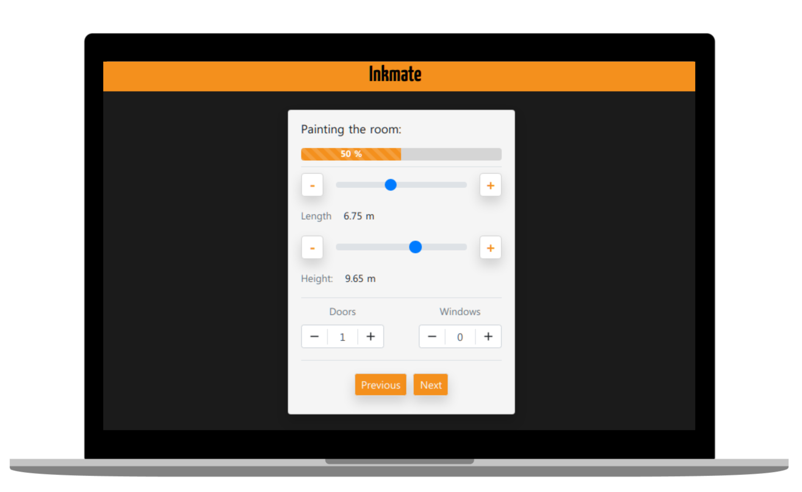

# Inkmate

<p align="center">
  
</p>

- ### Get the repo
```bash
$ git clone https://github.com/cardosorrenan/inkmate.git

$ cd inkmate
```
- ### Build setup

```bash
# install dependencies
$ yarn install

# serve with hot reload at localhost:3000
$ yarn dev

# build for production and launch server
$ yarn build
$ yarn start
```
- ### Test
```bash
# Running in
http://localhost:3030/
```